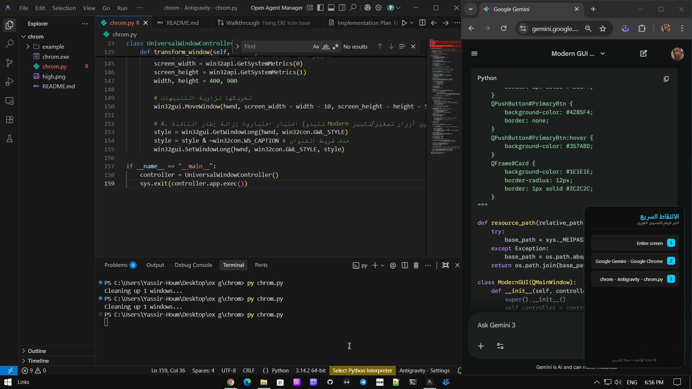
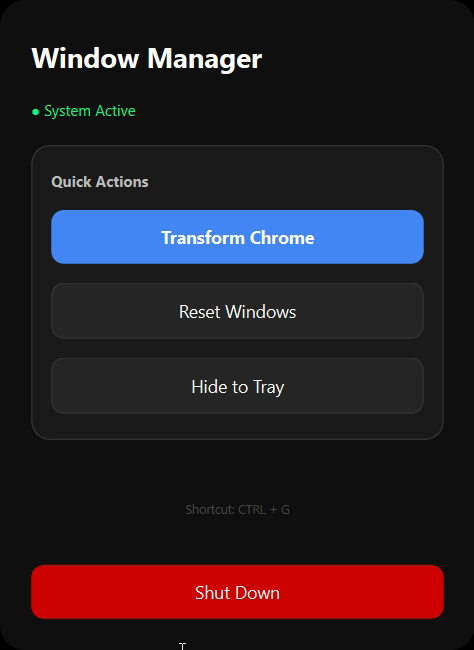

# Chrome View Controller 

**Chrome View Controller** is a productivity tool designed to transform your Google Chrome windows into a sleek, "chat-style" layout. It keeps your workspace organized by keeping specific Chrome windows elongated, always on top, and pinned to the corner of your screen.

---

##  Key Features

| Feature | Description |
| :--- | :--- |
| **Always on Top** | Keeps your selected Chrome window above all other applications. |
| **Chat Layout** | Automatically resizes windows to 400x900 for a vertical view. |
| **Global Shortcut** | Press `Ctrl + G` to show the window selection menu at your cursor. |
| **Auto-Restore** | Reverts windows to their normal state automatically when the app exits. |
| **System Tray** | Operates discreetly in the system tray area with a custom icon. |

---

## Screenshots & Demo

### Visual Interface
> [!NOTE] 
> Insert your application screenshots here to show the "Chat Style" transformation in action.

| Main Icon | Interface | Gui |
| :---: | :---: | :---: |
|  |  |  |

### 🎥 Video Demonstration

<p align="center">
  <video src="https://github.com/user-attachments/assets/6b3b61c5-63ea-4d43-b69b-d5d8a68195ae" width="100%" autoplay loop muted playsinline>
  </video>
</p>

---
<p align="center">
  <video src="https://github.com/user-attachments/assets/557d6eaa-9135-4b1b-84f5-121848dc4ea8" width="100%" autoplay loop muted playsinline>
  </video>
</p>
---

## How it Works

1. **Launch**: Open the application (or run the EXE).
2. **Select**: Press `Ctrl + G` or right-click the icon in the System Tray.
3. **Transform**: Choose the Google Chrome window you want to pin.
4. **Productivity**: Your window is now fixed in the corner, always visible while you work.
5. **Exit**: Choose "إغلاق البرنامج" to restore all windows to their original state.

---

## Download
[](https://github.com/YASSER-27/Chrome-Pin/releases) 

## Technical Guide (For Developers)

If you want to run the source code, ensure you have the following requirements:

```bash
pip install PyQt6 pygetwindow pywin32
```


*Developed with ❤️ for maximum productivity.*


